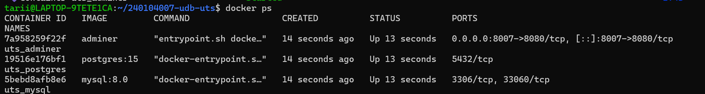
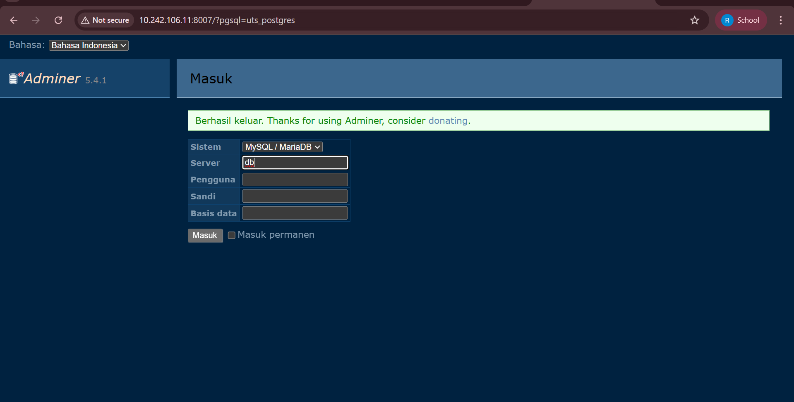
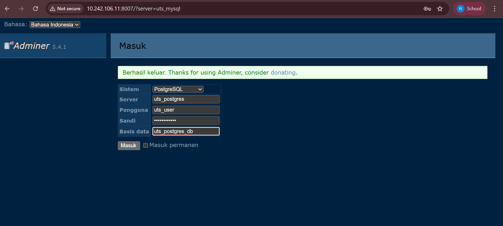

# UTS Praktikum Manajemen Jaringan

## Identitas Mahasiswa
- Nama : Rizki Dwi Lestari
- NIM  : 240104007

## Konfigurasi Project
- Repository : 240104007-udb-uts
- Network Docker : uts_internal_net
- Subnet : 172.30.7.0/24

## Port & Akses
- Adminer Port : 8007
- ZeroTier Network ID : 166359304e65b20d
- IP ZeroTier  : 10.242.106.11

Adminer diakses melalui jaringan ZeroTier dan tidak menggunakan localhost.

## Cara Menjalankan Project

1. Masuk ke direktori project:
```bash
cd 240104007-udb-uts

---

### 🔹 3️⃣ TAMBAHKAN BAGIAN SCREENSHOT (PALING PENTINNG

```md
## Screenshot

### Docker PS


### Adminer via ZeroTier


### Login Adminer ke MySQL


### Login Adminer ke PostgreSQL

